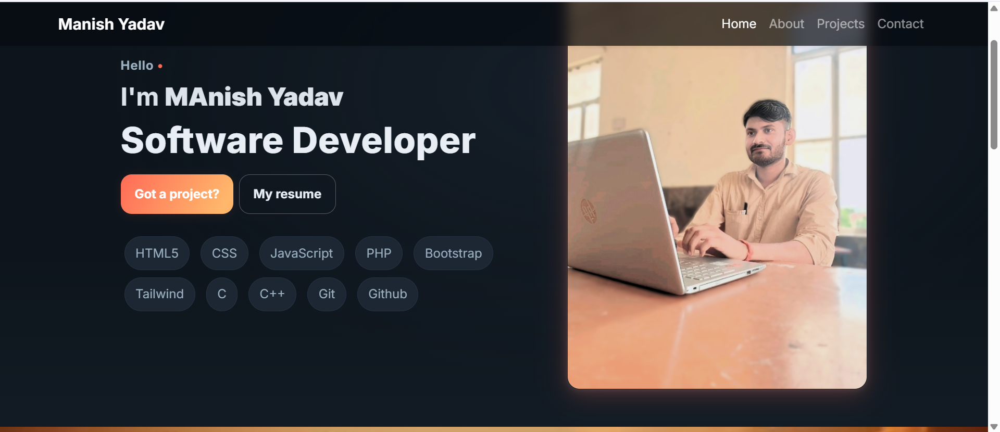
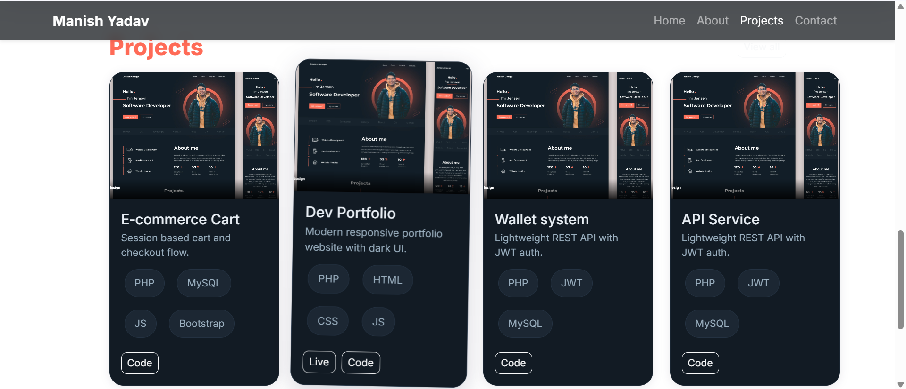

# 🌐 PHP Portfolio Website

A clean and responsive **portfolio website built with PHP, HTML, CSS, and JavaScript**.  
Showcase your **projects, skills, resume, and contact details** in a professional way.  

  

  
---

## ✨ Features
- ✅ Modern & responsive design  
- ✅ Dynamic project showcase  
- ✅ About Me & Skills section  
- ✅ Contact form with PHP backend (email support)  
- ✅ Easy to customize & deploy on any PHP server  

---

## 🛠️ Tech Stack
- **Frontend:** HTML5, CSS3, JavaScript, Bootstrap/Tailwind  
- **Backend:** PHP (Core PHP, no framework required)  
- **Database (optional):** MySQL (for projects & messages)  

---

## 🚀 Getting Started

### 1️⃣ Clone the repo
```bash
git clone https://github.com/username/php-portfolio-website.git
